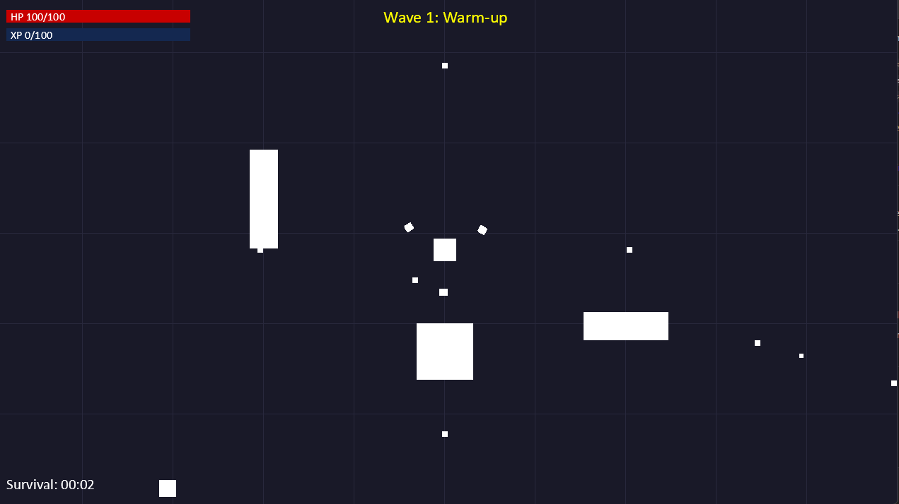

# Open Survivor

Open Survivor is an early-stage top-down survival shooter built with [Python Arcade](https://api.arcade.academy/). It currently includes a minimal engine, player character, and systems for spawning, combat, and leveling, providing a foundation to iterate on the game design captured in `GDD.md`.



## Project structure
- `game/` – Python package containing the game engine, content, and systems
  - `main.py` – entry point that creates the window and starts the engine
  - `core/` – rendering, input handling, and the main game loop
  - `content/` – characters, items, and other gameplay assets
  - `systems/` – spawning, combat, and leveling logic
- `GDD.md` – game design document used by `game/game.py` to parse section information

## Requirements
- Python 3.10+
- [pip](https://pip.pypa.io/en/stable/installation/) for installing dependencies

## Setup
1. Create and activate a virtual environment (recommended):
   ```bash
   python -m venv .venv
   source .venv/bin/activate
   ```
2. Install dependencies:
   ```bash
   pip install -r game/requirements.txt
   ```

## Running the game
From the repository root, launch the game window with:
```bash
python -m game.main
```
The window opens with the player centered on screen, and the engine updates spawning, combat, and leveling systems each frame.

## Using the GDD helper
To inspect the sections defined in `GDD.md` via the provided parser:
```bash
python -m game.game
```
This prints the top-level headings detected in the game design document and can be expanded to drive in-game content.
